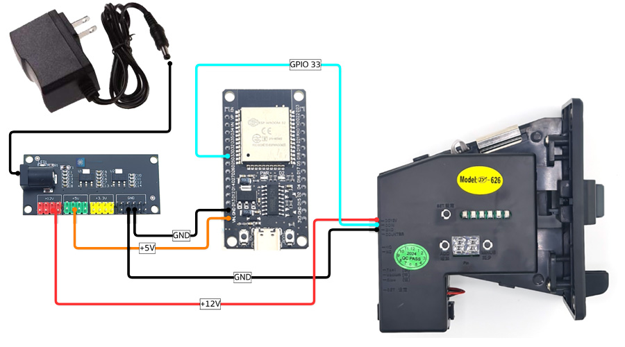
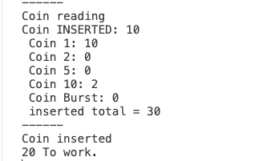

# ตัวนับเหรียญ MDM 💰

ตัวอย่างโค้ดการใช้งานเครื่องหยอดเหรียญ MDM กับ ESP32

## อุปกรณ์ 🛠️

- [ESP32](https://www.modulemore.com/product/2234/esp32-wroom-32-%E0%B9%81%E0%B8%9A%E0%B8%9A-usb-type-c-devkitc-v4-esp32-module-development-board-wifibtble-mcu-module-usb-c-i)
- [ตัวอ่านเหรียญ MDM](https://www.modulemore.com/product/2534)
- [12V power supply](https://www.modulemore.com/product/612/12v2a-switching-power-supply-power-adapter-220v-%E0%B9%80%E0%B8%9B%E0%B9%87%E0%B8%99-12v-2a)
- [สายไฟ](https://www.modulemore.com/search?q=jumper)
- [ตัวลดแรงดัน 12V -> 5V](https://www.modulemore.com/product/2160/)

## การต่อสาย 🔌

| ตัวลดแรงดัน | ตัวอ่านเหรียญ | ESP32 |
|--------------|----------------|-------|
| +12V         | +12V           | 
| GND          | GND            | GND   |
| +5V          |                | 5V    |
|              | COIN           | GPIO 33 |

ตัวอ่านเหรียญจ่ายไฟเลี้ยงด้วย 12VDC และมี Ground ร่วมกับ ESP32

## คำอธิบาย 📖

โปรเจคนี้รองรับการอ่านเหรียญ 1, 2, 5, 10 บาท และเหรียญ Burst (การหยอดเหรียญหลายๆ เหรียญอย่างรวดเร็ว) โดย class `Coin` สามารถย้ายไปยังไฟล์ `.h` ได้หากต้องการ

กรณีต้องการ calibrate เครื่องหยอดเหรียญใหม่ สามารถดูวิธีได้จาก [youtube](https://www.youtube.com/watch?v=M0UGFfYjF38)

## การใช้งาน 🚀

1. ตั้งค่าเครื่องหยอดเหรียญ(switch) ให้เป็น NO, FAST

2. ต่อสายตัวอ่านเหรียญกับ ESP32 ตามที่อธิบายในส่วนการต่อสาย
3. อัพโหลดโค้ดไปยัง ESP32
4. เปิด Serial Monitor ที่ baud rate 115200 เพื่อดูผลลัพธ์

## ลิขสิทธิ์ ©

© 2024